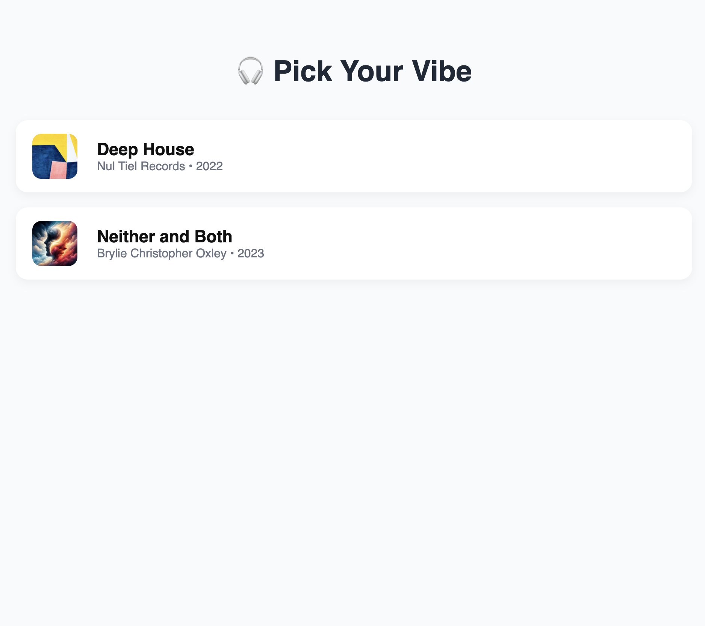
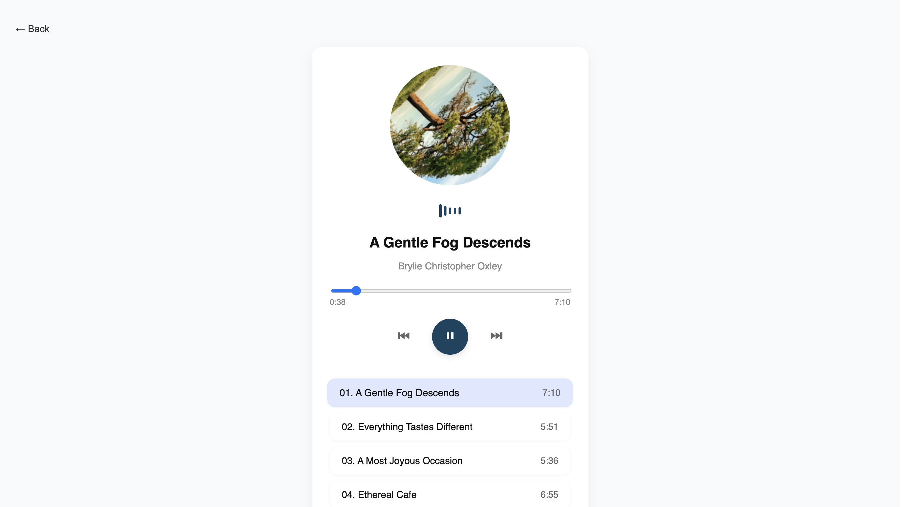

# 🎧 Linear Media Player – Submission by Arbaz Attar

Hi Linear team 👋  
Thanks for the opportunity to work on this — I thoroughly enjoyed the process of designing and building this app. Below is a walkthrough of what I built, how I approached it, and the care I put into getting every detail right.

---

## 📸 Preview Screens

> Below are two quick views of the final application — one for playlist selection and one showing the now-playing screen with interactive controls and animations.

### 🗂 Playlist Selection Page  

### 🎵 Now Playing View  

---

## ✨ What I Built

A clean and interactive React + TypeScript audio player that:

- 📁 Displays multiple playlists
- 🧠 Loads audio from a local JSON file (no API calls)
- 🎛 Lets users play, pause, skip, and scrub through tracks
- 💿 Features rotating album art & animated equalizer
- 🔁 Auto-plays next song after one ends
- 📱 Is fully responsive and touch-friendly

---

## 🧠 My Approach

I treated this project as more than a UI task — I tried to build something **thoughtful and polished** that could pass as a real product.

Here’s how I tackled it:

1. **Laid a clean folder structure** using TypeScript and Vite  
2. **Parsed the playlist JSON**, handling edge cases and broken audio/image links  
3. **Built player logic from scratch**, no external audio libraries  
4. **Added UX touches** like:
   - Album image rotation during playback  
   - Live-updating time display + seek bar  
   - Animated equalizer visible only when music is playing  
5. **Used only CSS Modules**, no design libraries — all UI is custom-styled  
6. **Iterated heavily on visual polish**:
   - Redesigned playlist list and player screens  
   - Switched to Unsplash/Pexels fallback images where needed  
   - Carefully debugged layout edge cases  
7. **Tested everything end-to-end** on multiple screen sizes  

---

## 🛠 Tech Stack

- React (functional components, hooks)
- TypeScript (typed props, state, and audio refs)
- Native HTML Audio API
- CSS Modules for scoped styling
- Unsplash & Pexels for dynamic artwork

---

## 🎯 Highlights

- 🎧 Fully working audio player with no 3rd-party packages  
- 🖼 Smart fallback images for broken/missing tracks  
- 🔊 Smooth animated equalizer when music is playing  
- 💿 Spinning circular album art synced with play/pause  
- 📏 Track duration/time updated and interactively seekable  
- 🧼 UI that's clean, calm, and easy on the eyes  

---

## 🔄 Next Steps (if continued)

If given the opportunity to move forward, here’s how I’d take this further:

- Add shuffle & repeat logic  
- Break up logic into reusable components  
- Store last played state in local storage  
- Add accessibility (ARIA labels, keyboard control)  
- Host a live demo via Vercel or Netlify  

---

## 💬 Closing Note

I really appreciated the freedom in this assignment — it gave me a chance to go beyond “just make it work” and build something I’m proud of. From audio handling to UI polish, every line of code here reflects my attention to detail and excitement to build great user experiences.

Thanks again for your time!  
Looking forward to the next step 🙏

— Arbaz Attar
